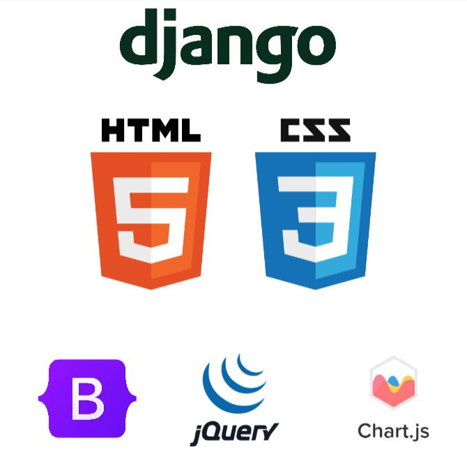
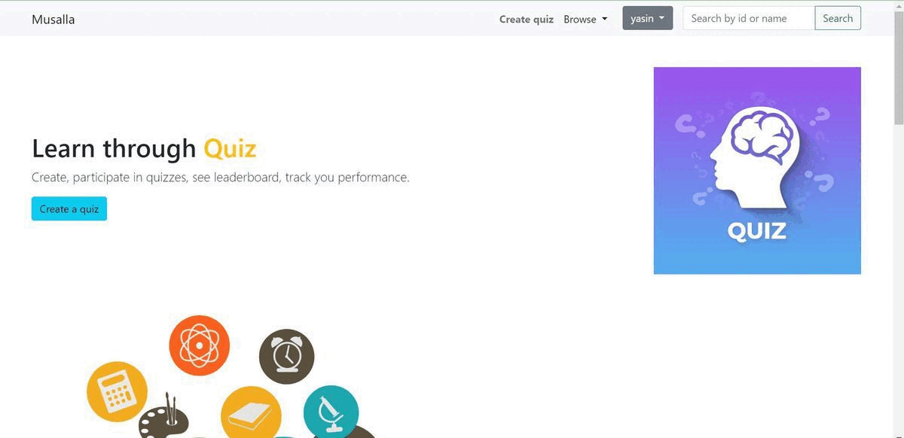

Musalla: An free and open-source online quiz platform.
===========

**Musalla** is an open-source, lightweight online quiz platform made with django.

### Key features ###

* Create quiz with TinyMCE rich text editor.
* Customize and configure options for each question, including specifying points.
* Currently supports two types of questions: single choice and multiple choice.
* Upload images for questions. Image upload is available with the rich text editor.
* Gain insights into quiz performance with leaderboard and statistics powered by chartJs.
* Secure your quizzes by creating private quizzes accessible only to specific users.
* Request clarification from the quiz creator while the quiz is running.
* TinyMCE is also integrated into Django admin.

## Tools and technologies ##


Musalla is made with dJango and follows the MVT (Model-View-Template)  architecture. The frontend is created with html, css, jquery, and bootstrap.
The platform is responsive and mobile-ready. 

## Musalla demo ##



## How to run in docker ##
```
docker build -t musalla:v1 .
```
```
docker run -p 8000:8001 musalla:v1 (8000 can be replaced with your desired port)
```
### Contribute ###

As a free and open-source project, we are grateful to anyone who helps us develop this platform. Currently, the platform is still in an immature state, and there is only one contributor.


### Contributors

- [Mohammad Yasin Arefin](https://github.com/yasinarefin)


